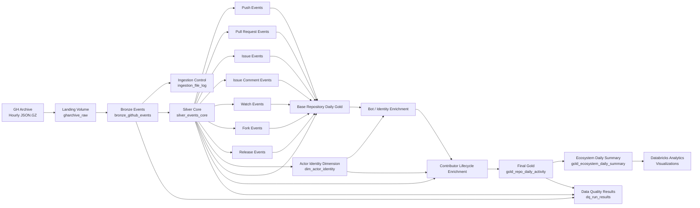

# Architecture

## Overview

The Open Source Ecosystem Intelligence Lakehouse processes hourly public GitHub event data from GH Archive using a Medallion-style architecture in Databricks.

The pipeline separates immutable source data, raw event preservation, normalized Silver models, analytical Gold models, identity enrichment, contributor lifecycle metrics, data quality controls, and final consumption outputs.



## Processing Layers

### Landing

GH Archive hourly `.json.gz` files are stored unchanged in:

`/Volumes/workspace/default/gharchive_raw`

The landing layer acts as immutable source storage. Existing files are not downloaded again.

### Bronze

Table:

`workspace.oss_ecosystem.bronze_github_events`

Bronze preserves the original event as `raw_json` while extracting only the top-level fields required for downstream processing.

Important characteristics:

- one logical row per GitHub event
- file-level ingestion tracking
- event-level deduplication using `event_id`
- source file and source hour metadata
- nested actor, repository, organization, and payload structures retained as JSON strings
- Delta Lake persistence

### Ingestion Control

Table:

`workspace.oss_ecosystem.ingestion_file_log`

The control table tracks hourly source files through ingestion states and enables incremental processing and rerun safety.

Typical statuses are:

- `discovered`
- `processing`
- `completed`
- `failed`

Only files that still require processing are eligible for ingestion.

### Silver Core

Table:

`workspace.oss_ecosystem.silver_events_core`

Silver Core normalizes fields shared by GitHub event types, including:

- event ID
- event type
- event timestamp
- actor ID and login
- repository ID and name
- organization ID
- source metadata

This table is the normalized event backbone of the lakehouse.

### Event-Specific Silver Models

Event-specific payload fields are parsed into dedicated Delta tables:

- `silver_push_events`
- `silver_pull_request_events`
- `silver_issue_events`
- `silver_issue_comment_events`
- `silver_watch_events`
- `silver_fork_events`
- `silver_release_events`

This avoids forcing event-specific payload structures into one wide and highly sparse schema.

### Identity Dimension

Table:

`workspace.oss_ecosystem.dim_actor_identity`

Stable GitHub actor IDs are used as the identity key.

The identity model:

- tracks observed login changes
- retains first and last observed timestamps
- identifies obvious bot accounts conservatively
- treats usernames ending in `[bot]` as bots
- classifies all other accounts as human or unknown

The bot rule is intentionally conservative and should not be interpreted as complete bot detection.

### Gold Repository Daily Activity

Table:

`workspace.oss_ecosystem.gold_repo_daily_activity`

Grain:

`repo_id + event_date`

The Gold table combines repository activity, contributor participation, event-type metrics, bot enrichment, contributor concentration, and lifecycle metrics.

Repository name is treated as mutable descriptive metadata rather than part of the table grain.

### Contributor Lifecycle

Lifecycle metrics are calculated only for actors classified as `human_or_unknown`.

`newly_observed_contributors` means that the contributor was first observed in that repository during the seven-day dataset.

It does **not** mean that the contributor was historically new to the repository.

`returning_contributors` means the contributor had already been observed in the same repository on an earlier date within the dataset.

### Ecosystem Consumption Layer

Table:

`workspace.oss_ecosystem.gold_ecosystem_daily_summary`

This small Gold consumption model provides daily ecosystem-level metrics for visualization, including:

- total events
- active repositories
- bot event share
- newly observed contributors
- returning contributors
- returning contributor share
- stars
- forks
- opened pull requests
- opened issues

The dashboard is intentionally limited because the primary purpose of the project is Data Engineering rather than BI development.

## Orchestration

The production pipeline is orchestrated with Databricks Workflows.

Core dependency flow:

```text
bronze_ingestion
        |
        v
silver_core
        |
        +-------------------------------+
        |       |       |       |       |
        v       v       v       v       v
      Push     PR     Issue   Comment  Watch
        |                               |
        +---------- Fork --- Release ---+
                        |
                        v
                 gold_repo_daily
                        |
                        v
              bot_identity_enrichment
                        |
                        v
          contributor_lifecycle_metrics
                        |
                        v
               data_quality_checks
```

The seven event-specific Silver tasks run in parallel after Silver Core succeeds.

Gold processing waits for all required Silver event tables.

Data quality executes after the final Gold enrichment stage.

## Final Scale

The final engineering scale test uses seven complete days of GH Archive data from September 1 through September 7, 2026.

Measured scale:

- 168 hourly source files
- approximately 5.964 GB compressed raw data
- 8,838,503 Bronze events
- 8,838,503 Silver Core events
- 1,785,239 repository-day Gold rows
- zero duplicate Bronze event IDs after deduplication
- zero duplicate Silver event IDs
- zero duplicate Gold `repo_id + event_date` keys

The project intentionally stops at seven days because this scale is sufficient to demonstrate the engineering design without increasing compute usage only for a larger headline number.